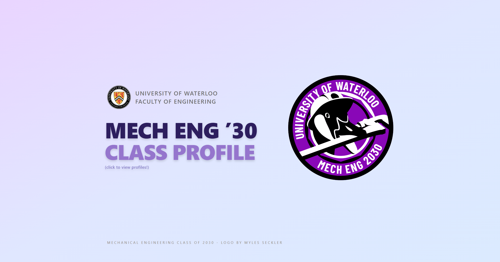

# [UWME.ca](https://uwme.ca/) — Waterloo Mechanical Engineering Class of 2031

UWME.ca is a web application designed to showcase the projects, skills, and profiles of the University of Waterloo Mechanical Engineering Class of 2031. Built as a community hub, the platform connects students with peers, mentors, and prospective employers.

---

## 🌟 Overview

Created to bring visibility to the MechE 2031 cohort, UWME.ca serves as a central directory for student portfolios, achievements, and contact information. 

* **Community Hub:** Provides a unified platform for classmates to display their engineering work and personal projects.
* **Employer Engagement:** Gives recruiters and industry professionals direct insight into cohort talent and technical capabilities.
* **Proven Reach:** Generated 7,000+ unique visitors within its first month of launch and continues to serve as an active community resource.

---

## 🛠️ Tech Stack

* **Frontend:** React / Next.js, TypeScript
* **Styling:** Tailwind CSS
* **Version Control & Hosting:** Git, GitHub, Vercel
